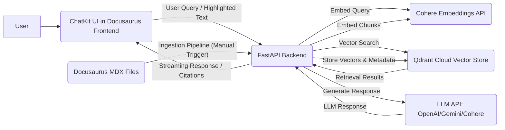

# Implementation Plan: Integrated RAG Chatbot

**Feature Branch**: `003-rag-chatbot`
**Created**: 2025-12-07
**Status**: In Progress

## 1. Technical Context & Architecture

The RAG Chatbot will integrate a FastAPI backend with a Docusaurus frontend, leveraging Cohere for embeddings and Qdrant Cloud for vector storage.

### Architecture Sketch:



### Flow Description:
1.  **User Interaction**: User asks a question via the ChatKit UI in the Docusaurus frontend or highlights text and asks a question.
2.  **Frontend to Backend**: The ChatKit UI sends the user's query and optionally the highlighted text to the FastAPI backend.
3.  **Embedding**: FastAPI uses Cohere to convert the query (and/or highlighted text) into a vector embedding.
4.  **Retrieval**: FastAPI queries Qdrant Cloud with the embedding to find relevant content chunks from the book.
5.  **Generation**: FastAPI constructs a prompt using the original query and the retrieved content, then sends it to an LLM to generate a grounded response.
6.  **Response**: The LLM's response, along with citations and similarity scores, is streamed back to the ChatKit UI.
7.  **Ingestion**: A separate, potentially manual, process extracts content from Docusaurus MDX files, chunks it, embeds it using Cohere, and stores it in Qdrant.

## 2. Constitution Check

This plan adheres to the project constitution as follows:
-   **I. Technical Accuracy**: The RAG approach ensures answers are grounded in the book's content.
-   **II. Clarity and Accessibility**: The chatbot enhances accessibility by providing direct answers and context.
-   **III. Reproducible Engineering**: The use of well-defined APIs (FastAPI, Cohere, Qdrant) and modular components promotes reproducibility.
-   **IV. Clear Scope**: The focus on book content QA maintains clear scope.
-   **V. Chapter Translation**: (Not directly impacted by this feature, but compatible with frontend changes.)
-   **Content and Format Standards**: The ingestion pipeline will respect MDX formatting.
-   **Security**: API keys are strictly backend-only, aligning with security principles.

## 3. Development Phases

### Phase 1: Backend Core (FastAPI, Cohere, Qdrant Integration)
-   **Goal**: Establish a functional backend service capable of embedding, vector search, and LLM communication.
-   **Tasks**: Implement FastAPI endpoints: `/embed`, `/query`, `/chat`. Set up Cohere and Qdrant clients.

### Phase 2: Ingestion Pipeline
-   **Goal**: Develop a script or endpoint to process Docusaurus content into Qdrant-ready chunks.
-   **Tasks**: Implement MDX parsing, chunking logic, metadata extraction, embedding generation, and Qdrant upsertion.

### Phase 3: Frontend Integration (ChatKit UI)
-   **Goal**: Embed the ChatKit UI into the Docusaurus book and connect it to the FastAPI backend.
-   **Tasks**: Create a React component for the chatbot widget, integrate ChatKit SDK, configure communication with FastAPI.

### Phase 4: Highlight-to-RAG Implementation
-   **Goal**: Enable the chatbot to answer questions based on user-selected text.
-   **Tasks**: Implement frontend logic to capture selected text. Modify ChatKit UI to pass selection to FastAPI. Update FastAPI `/chat` endpoint to handle `selected_text_context`.

### Phase 5: Deployment & Hardening
-   **Goal**: Deploy the FastAPI backend and integrate with Docusaurus deployment.
-   **Tasks**: Configure production deployment for FastAPI (Fly.io/Render). Ensure all API keys are environment variables.

## 4. Key Decisions & Rationale

-   **FastAPI for Backend**: High performance, asynchronous capabilities suitable for I/O bound RAG tasks.
-   **Qdrant Cloud (Free Tier)**: User-specified, cost-effective vector store.
-   **Cohere Embed v3**: User-specified embedding model.
-   **ChatKit SDK**: Simplifies frontend UI development for a chatbot experience.
-   **LLM Choice**: Initial plan to use a general-purpose LLM (e.g., OpenAI GPT-3.5/4, Gemini, or Cohere Command R) accessible via a Python SDK in FastAPI. Specific choice can be deferred or made based on availability/cost.

## 5. Detailed File Tree (Backend & Frontend)

```
/
├── backend/
│   ├── app/
│   │   ├── __init__.py
│   │   ├── main.py                # FastAPI app, endpoints
│   │   ├── services/
│   │   │   ├── qdrant.py          # Qdrant client interactions
│   │   │   ├── cohere_embed.py    # Cohere embedding service
│   │   │   ├── llm_generation.py  # LLM interaction service
│   │   │   └── chunking.py        # Text chunking logic
│   │   └── models/
│   │       └── api_models.py      # Pydantic models for API
│   ├── ingestion_script.py        # Standalone script for initial content ingestion
│   ├── requirements.txt
│   └── .env.example
├── humanoid-robotics-book/        # Existing Docusaurus project
│   └── src/
│       └── components/
│           └── RAGChatbotWidget/  # React component for ChatKit UI
│               ├── index.tsx
│               └── styles.module.css
│   └── docusaurus.config.ts       # Link to chatbot component
│   └── package.json
├── .github/workflows/
│   └── deploy_backend.yml         # CI/CD for FastAPI backend (e.g., to Fly.io/Render)
```

## 6. FastAPI Endpoints & Schemas (as per `data-model.md`)

-   `/ingest` (POST)
-   `/embed` (POST)
-   `/query` (POST)
-   `/chat` (POST)

(Full request/response schemas detailed in `data-model.md`)

## 7. Chunking Pipeline for Docusaurus Content

1.  **Content Extraction**: Read MDX files from `humanoid-robotics-book/docs/`.
2.  **Markdown Parsing**: Parse MDX to extract raw text, section headings, and other relevant metadata.
3.  **Chunking**: Split raw text into overlapping chunks of ~300-500 tokens. Ensure chunks do not split across critical semantic boundaries (e.g., don't break code blocks in half).
4.  **Metadata Association**: For each chunk, capture `id`, `text`, `chapter`, `section`, `url`.
5.  **Embedding**: Use Cohere Embed v3 via FastAPI's `/embed` endpoint or direct Cohere client to generate an embedding for each chunk.
6.  **Storage**: Upsert (insert/update) chunks and their embeddings into the `docusaurus_chunks` collection in Qdrant Cloud.

## 8. Qdrant Cloud & Cohere Configuration Steps

### Qdrant Cloud:
1.  Create a free-tier account on Qdrant Cloud.
2.  Create a new collection named `docusaurus_chunks`.
3.  Configure vector size to match Cohere Embed v3 output dimensions.
4.  Set distance metric to `Cosine`.
5.  Obtain Qdrant URL and API Key.

### Cohere Embeddings:
1.  Obtain Cohere API Key.

### Environment Variables:
-   `COHERE_API_KEY`: For Cohere authentication.
-   `QDRANT_HOST`: Qdrant Cloud URL.
-   `QDRANT_API_KEY`: Qdrant Cloud API Key.
-   `LLM_API_KEY`: (If using OpenAI/Gemini/other for LLM).
-   `LLM_MODEL_NAME`: (e.g., `gpt-4`, `gemini-pro`, `command-r`).

These variables MUST be configured in the FastAPI deployment environment (e.g., Fly.io/Render secrets).

## 9. ChatKit UI Integration into Docusaurus Frontend

1.  **Create React Component**: Develop `humanoid-robotics-book/src/components/RAGChatbotWidget/index.tsx`.
2.  **Integrate ChatKit SDK**: Use the ChatKit SDK within this React component to render the chatbot UI.
3.  **Connect to FastAPI**: Configure the ChatKit SDK to communicate with the deployed FastAPI `/chat` endpoint.
4.  **Embed Widget**: Add the `RAGChatbotWidget` component to the Docusaurus layout (e.g., via `docusaurus.config.ts` or swizzling a layout component) to ensure it appears on every page.

## 10. Highlight-to-RAG Implementation Steps

1.  **Frontend (JavaScript)**:
    -   Add event listeners to capture user text selections (`window.getSelection()`).
    -   Display a context menu/button ("Ask about this") when text is selected.
    -   When the button is clicked, extract the selected text.
    -   Pass the `selected_text_context` to the FastAPI `/chat` endpoint.
2.  **Backend (FastAPI `/chat` endpoint)**:
    -   If `selected_text_context` is present in the request, prioritize embedding and querying based on this text only.
    -   If `selected_text_context` is not present, fall back to global RAG mode using `user_message`.

## 11. Testing Strategy

-   **Unit Tests**: For individual FastAPI services (embedding, Qdrant interaction, LLM calls).
-   **Integration Tests**:
    -   **Ingestion**: Verify Docusaurus content is correctly chunked, embedded, and stored in Qdrant with proper metadata.
    -   **Global RAG**: Test with various questions (e.g., "What is the purpose of ROS2 topics?") and validate answers for accuracy and citations.
    -   **Highlight RAG**: Highlight specific paragraphs and ask questions, ensuring retrieval is limited to the highlighted text.
    -   **Latency**: Measure vector search and LLM generation times.
-   **End-to-End Tests**: Simulate user interaction with the ChatKit UI and verify full RAG pipeline functionality.

## 12. Validation Checklist for Production

-   [ ] No API keys are present in the client-side code.
-   [ ] All sensitive API keys are loaded via environment variables on the FastAPI server.
-   [ ] Qdrant vectors are written and read successfully, maintaining data integrity.
-   [ ] ChatKit streaming responses function correctly.
-   [ ] Highlight-to-RAG mode accurately restricts retrieval context.
-   [ ] Production deployments (Vercel/Fly.io/Render) are configured and working.
